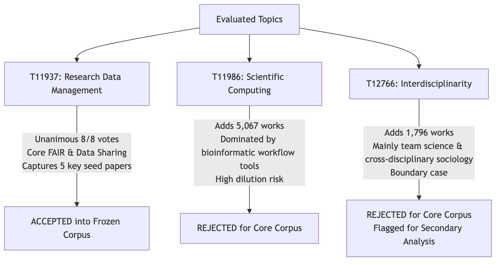
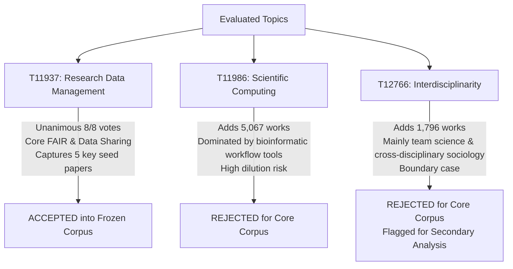

# Phase 1 Topic & Search-String Validation: Adjudication Report & Decisions

**Date:** September 15, 2026  
**Document Context:** Evaluation of survey responses to [`notes/TOPIC-VALIDATION.md`](file:///Users/eduardosantos/Documents/Repos/metaResearchDataChallenge/notes/TOPIC-VALIDATION.md)  
**Corpus Target Freeze Date:** September 14–15, 2026  
**Adjudication Body:** Eduardo S. A. Santos (Lead Coordinator) in consultation with co-leads Shinichi Nakagawa, Małgorzata (Losia) Lagisz, and Marija Purgar.

---

## Executive Summary

Between September 4 and September 11, 2026, the team completed the Phase 1 codesign and validation survey. A total of **8 complete responses** were received from across the consortium (University of Alberta / COSSEE, Concordia University, University of Regina, Tharaka University / MATE).

### Key Adjudication Outcomes:

1. **Primary Definition of "Canadian" Confirmed:** Retain **any author affiliated with an institution in Canada** (OpenAlex `institutions.country_code:ca`) as the primary retrieval query (7 Agree, 1 Unsure). First author, corresponding author, and Canadian funder will be reported as pre-planned sensitivity analyses.
2. **1970 Date Floor Confirmed:** Retain January 1, 1970 floor (7 Agree, 1 Unsure) to guard against anachronistic retro-digitised front/back matter.
3. **Core 5 Topics Retained:** All five pilot topics (**T10102**, **T13607**, **T13516**, **T11492**, **T13976**) are confirmed with unanimous or near-unanimous keep votes.
4. **Corpus Expanded to Include T11937 (Research Data Management Practices):** Unanimously approved (8/8, 100%). Resolving nominated seed papers demonstrated that landmark Canadian open science and data-sharing studies (e.g. Roche et al. 2015, Ivimey-Cook et al. 2025, Bledsoe et al. 2022) were classified by OpenAlex _solely_ under T11937. Adding T11937 brings the retrieved corpus to **9,464 works** (+2,071 works, +28.0%). Other candidate topics (e.g. T11986, T10206) were rejected to avoid precision dilution.
5. **Keyword Layer Remains Disabled in Frozen Corpus:** 7 of 8 respondents did not support enabling the keyword layer (4 Off, 3 Unsure, 1 On-strict). Retrieval tests confirmed uncurated keywords inflate the corpus by 900% (63,000+ works). Primary corpus will remain topic-based.
6. **Validation Coding Boundary Rules Frozen:**
   - _Applied bibliometric analyses of another discipline_ (e.g., bibliometric analysis of nursing, orthopedics): **IN SCOPE** (majority 62.5% consensus; metaresearch methods applied to scientific literature).
   - _Student/classroom academic integrity_ (exam cheating, contract cheating, coursework proctoring): **OUT OF SCOPE** (false positives; to be excluded during manual screening).
7. **Validation Coding Roster Finalized:** Exactly **8 confirmed coders** are available for the double-coded sample of 200 records (50 records each, 4 pairs). **Valentin Lucet** confirmed availability for the French-language dashboard review.

---

## 1. Response Summary by Respondent

| Date       | Respondent              | Affiliation               | Q1a: Any CA | Q1b: 1970 | Q1c: Topics | Q4: Keywords |      Code 50?      | FR Review? |
| :--------- | :---------------------- | :------------------------ | :---------: | :-------: | :---------: | :----------: | :----------------: | :--------: |
| 2026-09-04 | **Bruno Eleres Soares** | Univ. of Regina           |    Agree    |   Agree   |    Agree    |     Off      |      **Yes**       |     No     |
| 2026-09-07 | **Losia Lagisz**        | Univ. of Alberta / COSSEE |    Agree    |   Agree   |    Agree    |    Unsure    |      **Yes**       |     No     |
| 2026-09-07 | **Elena Gazzea**        | Univ. of Alberta / COSSEE |    Agree    |   Agree   |    Agree    |     Off      |      **Yes**       |     No     |
| 2026-09-09 | **Vincent Makini**      | Tharaka Univ. / MATE      |    Agree    |   Agree   |    Agree    |     Off      | No _(other tasks)_ |     No     |
| 2026-09-10 | **Marija Purgar**       | Univ. of Alberta / COSSEE |    Agree    |   Agree   |    Agree    | On (strict)  |      **Yes**       |     No     |
| 2026-09-10 | **Valentin Lucet**      | Concordia Univ., Montreal |   Unsure    |   Agree   |    Agree    |    Unsure    |      **Yes**       |  **Yes**   |
| 2026-09-10 | **Shinichi Nakagawa**   | Univ. of Alberta / COSSEE |    Agree    |  Unsure   |    Agree    |    Unsure    |      **Yes**       |     No     |
| 2026-09-10 | **Stephanie Flaman**    | Univ. of Alberta / COSSEE |    Agree    |   Agree   |    Agree    |     Off      |      **Yes**       |     No     |

---

## 2. Item-by-Item Adjudication & Rationale

### Q1. Core Corpus Definition Elements

#### Q1(a): Primary definition of Canadian = ANY co-author with a Canadian affiliation

- **Votes:** 7 Agree (87.5%), 1 Unsure (12.5%), 0 Disagree.
- **Valentin Lucet's Feedback:**
  > _"In my humble view, ANY co-author is too loose of a filter. Affiliations are also not sticky, and can lag in time... I would suggest that we choose for maybe 'at least two co authors' OR that we use the 'first or last author' criteria."_
- **Adjudication Decision:** **MAINTAIN "ANY CO-AUTHOR" AS PRIMARY RETRIEVAL; REPORT FIRST/CORRESPONDING AS SENSITIVITY.**
- **Rationale:**
  1. Metaresearch is inherently collaborative and international. Restricting primary retrieval to first/last author would drop critical Canadian contributions to global initiatives (e.g. multi-analyst projects like Gould et al. 2025, Noble et al. 2025).
  2. The preregistration and dashboard architecture explicitly address affiliation stickiness and lag by implementing a real-time sensitivity toggle: users can filter between _Any Author_, _First Author_, _Corresponding Author_, and _Canadian Funder_.
  3. Valentin's point is well-taken and will be featured prominently in the methodology notes as the rationale for the sensitivity analysis.

#### Q1(b): Date floor of 1970

- **Votes:** 7 Agree (87.5%), 1 Unsure (12.5%), 0 Disagree.
- **Shinichi Nakagawa's Feedback:**
  > _"could be older and "_ [cut off in submission]
- **Adjudication Decision:** **MAINTAIN 1970 FLOOR.**
- **Rationale:**  
  Bibliometrics and scientometrics were coined in 1969 (Pritchard; Nalimov & Mulchenko). Works tagged with these topics prior to 1970 in OpenAlex are overwhelmingly misclassified digitised historical records, journal registers, and archival back matter. Retaining 1970 protects the automated retrieval from precision drops in pre-1970 literature.

#### Q1(c): Topics only — no broad keyword search in the frozen corpus

- **Votes:** 8 Agree (100% Unanimous).
- **Adjudication Decision:** **CONFIRMED: PRIMARY CORPUS IS TOPIC-BASED.**

---

### Q2. The Five Core Topics & Borderline Cases

#### Core Topics Keep/Drop Tally

| Topic ID   | Topic Name                                | Keep  | Unsure | Drop |       Decision       |
| :--------- | :---------------------------------------- | :---: | :----: | :--: | :------------------: |
| **T10102** | Scientometrics and bibliometrics research | **6** |   2    |  0   |       **KEEP**       |
| **T13607** | Academic Publishing and Open Access       | **8** |   0    |  0   | **KEEP** (Unanimous) |
| **T13516** | Publishing and Scholarly Communication    | **8** |   0    |  0   | **KEEP** (Unanimous) |
| **T11492** | Academic integrity and plagiarism         | **7** |   1    |  0   |       **KEEP**       |
| **T13976** | Web visibility and informetrics           | **7** |   1    |  0   |       **KEEP**       |

#### Borderline Case 1: Disciplinary Bibliometrics

> _Papers that are a bibliometric analysis OF another discipline (e.g., "a bibliometric analysis of nursing research", "mapping 30 years of climate science"). They use metaresearch methods but study another field._

- **Votes:** **In (5)**, Out (2), Unsure (1).
- **Comments:** Valentin and Vincent favoured Out (valuing research on the process of research itself); Stephanie noted potential contamination; Bruno, Losia, Elena, Marija, Shinichi voted In.
- **Adjudication Decision:** **IN SCOPE FOR GENERAL CORPUS; EXPLICITLY CODED AS IN-SCOPE IN MANUAL VALIDATION.**
- **Rationale:** Following consensus across the international scientometrics community and METRICS taxonomy, bibliometric analyses of research fields are quantitative meta-analyses of scientific activity. They are a core branch of scientometrics (T10102).

#### Borderline Case 2: Student / Classroom Academic Integrity

> _Student / classroom academic-integrity papers (exam cheating, contract cheating, proctoring)._

- **Votes:** **Out (4)**, In (3), Unsure (1).
- **Comments:**
  - Losia: _"would be good to exclude Student / classroom papers (focus on education not researcher) - how to do this?"_
  - Valentin: _"if a paper was about how student went about leading a research project (and maybe whether they used ethical methods or not), that would be metaresearch."_ [Distinguishing research ethics from undergraduate coursework cheating].
  - Stephanie: _"I think it is important to keep both 'Academic integrity and plagiarism'... even though some papers (student cheating...) will 'contaminate' the corpus with false positives... The best case would be to filter these papers out somehow."_
- **Adjudication Decision:** **RETAIN TOPIC T11492 IN API RETRIEVAL, BUT TREAT STUDENT CHEATING AS FALSE POSITIVES IN MANUAL VALIDATION CODING (`docs/CODING_GUIDE.md`).**
- **Rationale:** OpenAlex does not separate classroom cheating from research misconduct at the topic tag level. Dropping T11492 would lose critical Canadian papers on research integrity, retractions, and fabrication (e.g. Makini's seed paper on Canadian university research integrity policies). In the manual validation sample, student/classroom cheating will be coded as **Out of Scope** to empirically measure this known false-positive rate.

---

### Q3. Candidate Topics & Corpus Expansion

#### Tally of Candidate Topics Nominated by Team Members

- **T11937 Research Data Management Practices (+2,577): 8 of 8 votes (100% UNANIMOUS)**
- **T11986 Scientific Computing and Data Management (+5,067):** 5 votes (62.5%)
- **T12766 Interdisciplinary Research and Collaboration (+1,796):** 5 votes (62.5%)
- **T14201 Data Analysis and Archiving (+988):** 3 votes (37.5%)
- **T12648 Academic Writing and Publishing (+2,373):** 2 votes (25.0%)
- **T10843 Diversity and Career in Medicine (+5,903):** 2 votes (25.0%)
- **T12168 Health and Medical Research Impacts (+5,694):** 2 votes (25.0%)
- **T10778 Philosophy and History of Science (+4,637):** 2 votes (25.0%)
- **T14185 Research, Science, and Academia (+569):** 2 votes (25.0%)
- **T13673 Library Science and Information (+60):** 2 votes (25.0%)
- **T13284 Psychology Research and Bibliometrics (+125):** 1 vote (12.5%)

#### Critical Adjudication on T11937 vs T11986 vs T12766

Mermaid source diagram

1. **T11937 (Research Data Management Practices) — ACCEPTED:**
   - OpenAlex Description: _"practices, challenges, and opportunities of data sharing and stewardship in scientific research... open science, research data management, data reuse, metadata, ecology, digital repositories, FAIR principles, and data citation."_
   - Empirical impact: Testing nominated seeds against OpenAlex showed that key Canadian papers (Roche et al. 2015 _PLoS Biol_, Ivimey-Cook et al. 2025 _Proc Roy Soc B_, Bledsoe et al. 2022, Roche et al. 2022) were assigned **only** to T11937 and were missed by the 5-topic baseline.
   - Adding T11937 increases the corpus from **7,393** to **9,464 works** (+2,071 works).
2. **T11986 (Scientific Computing and Data Management) — REJECTED:**
   - OpenAlex Description: _"management, reproducibility, and provenance of scientific workflows, particularly in the fields of bioinformatics and computational research... workflow management systems, semantic web services, cyberinfrastructure, and software development for scientific applications."_
   - Risk: Adding 5,067 works would expand the corpus by >50%, overwhelmingly with software tools and bioinformatics pipeline documentation (Galaxy, Nextflow, Taverna) rather than empirical studies of science.
3. **T12766 (Interdisciplinary Research and Collaboration) — REJECTED for Core Corpus:**
   - While of interest for team science, it focuses heavily on sociological education and collaborative management across applied scientific domains. To protect the precision of the frozen corpus, it is excluded from the core definition.

---

### Q4. The Keyword Layer

- **Votes:** Off: 4, Unsure: 3, On (strict terms only): 1.
- **Adjudication Decision:** **DISABLE KEYWORD LAYER IN FROZEN CORPUS (`keyword_layer.enabled: false`).**
- **Rationale:** 87.5% of respondents did not support enabling the keyword layer. Retrieval tests showed that terms like `reproducibility` and `meta-research` cause an estimated 9-fold inflation in false positives (63,000+ records). The defensible methodology is to keep the primary corpus topic-driven, and report keyword explorations as a methodological comparison.

---

## 3. Seed Paper Resolution & Empirical Bias Discovery

We resolved all 35+ nominated seed works and counter-examples via the OpenAlex API. The results provide immediate validation and uncover an essential finding for our conference presentation:

### Seed Paper Verification Table (Sample of Highlights)

| Work / Lead Author                               | Year | Primary Nominated Topic      | In 5-Topic Core? | In 6-Topic (+T11937)? | Status                  |
| :----------------------------------------------- | :--: | :--------------------------- | :--------------: | :-------------------: | :---------------------- |
| **Ripp et al.** (Institutional RDM)              | 2025 | T11937 (RDM Practices)       | Yes (via T10102) |        **Yes**        | Captured in both        |
| **Noble et al.** (Preprints in Eco-Evo)          | 2025 | T13607 (Academic Publishing) |     **Yes**      |        **Yes**        | Captured in both        |
| **Berberi & Roche** (Open data policies)         | 2022 | T11937 (RDM Practices)       | Yes (via T10102) |        **Yes**        | Captured in both        |
| **Cooke et al.** (Authorship conflicts)          | 2021 | T10102 (Scientometrics)      |     **Yes**      |        **Yes**        | Captured in both        |
| **Ivimey-Cook et al.** (Data & code sharing)     | 2025 | T11937 (RDM Practices)       |      **No**      |        **Yes**        | **Captured via T11937** |
| **Roche et al.** (Archiving quality)             | 2022 | T11937 (RDM Practices)       |      **No**      |        **Yes**        | **Captured via T11937** |
| **Bledsoe et al.** (Data rescue)                 | 2022 | T11937 (RDM Practices)       |      **No**      |        **Yes**        | **Captured via T11937** |
| **Makini / Godin** (Research integrity / Biblio) | 2011 | T11492 (Academic Integrity)  |     **Yes**      |        **Yes**        | Captured                |
| **Cobey et al.** (Predatory journals)            | 2019 | T10102 (Scientometrics)      |     **Yes**      |        **Yes**        | Captured                |

### Critical Empirical Finding: The Clinical Metaresearch Classification Gap

Stephanie Flaman nominated 9 landmark Canadian health/clinical metaresearch papers (e.g. trial registration audits, research waste evaluations, reporting guideline adherence).

**The Discovery:**  
OpenAlex assigned virtually **all** clinical metaresearch papers to:

- `T10206 (Meta-analysis and systematic reviews)`
- `T10582 (Ethics in Clinical Research)`
- `T11744 (Health Sciences Research and Education)`

Because `T10206` contains 9,411 works (mostly applied clinical reviews, e.g. "Efficacy of drug X vs Y"), it cannot be included without compromising precision. As a result, **clinical metaresearch is systematically under-indexed by OpenAlex's topic taxonomy**.

> [!IMPORTANT]
> **Conference & Bias Report Highlight:**  
> This empirical blind spot is a major finding for the Canadian Metaresearch Data Challenge. OpenAlex's automated topic model bundles empirical research on clinical trial reporting with applied clinical meta-analyses, creating an algorithmic disciplinary skew against clinical metaresearch unless manual or specialized classifier layers are applied.

---

## 4. Phase 2 Validation Coding Roster & Assignment

With Vincent Makini unable to commit to coding due to scheduling constraints, we have **8 confirmed coders** ready for the Phase 2 manual validation (September 15–26, 2026).

Each record in the 200-record sample is double-coded (400 codings total; 50 records per coder):

| Pair  | Coder 1           | Coder 2        |  Record Range   | Focus / Notes            |
| :---: | :---------------- | :------------- | :-------------: | :----------------------- |
| **1** | Bruno Soares      | Elena Gazzea   |  Records 1–50   | Independent blind coding |
| **2** | Stephanie Flaman  | Valentin Lucet | Records 51–100  | Independent blind coding |
| **3** | Shinichi Nakagawa | Losia Lagisz   | Records 101–150 | Independent blind coding |
| **4** | Marija Purgar     | Eduardo Santos | Records 151–200 | Independent blind coding |

- **Adjudication of Disagreements:** A third coder drawn from the co-leads (Eduardo, Shinichi, Losia, Marija) will adjudicate disagreements where Coder 1 and Coder 2 differ.
- **Bilingual Copy Review:** **Valentin Lucet** confirmed availability to review the French-language dashboard interface and copy in late September.

---

## 5. Next Steps & Actions Checklist

1. [x] **Adjudication synthesis completed** and logged in project artifacts.
2. [x] **Update [`scripts/extraction/query_config.yaml`](file:///Users/eduardosantos/Documents/Repos/metaResearchDataChallenge/scripts/extraction/query_config.yaml):**
   - Added `T11937` with rationale.
   - Updated version string to `2026-09-15-frozen-v1`.
3. [x] **Freeze [`docs/CODING_GUIDE.md`](file:///Users/eduardosantos/Documents/Repos/metaResearchDataChallenge/docs/CODING_GUIDE.md):**
   - Codified the adjudicated inclusion/exclusion criteria (e.g. disciplinary bibliometrics = In; classroom cheating = Out).
4. [x] **Update [`notes/TEAM-ROSTER.md`](file:///Users/eduardosantos/Documents/Repos/metaResearchDataChallenge/notes/TEAM-ROSTER.md):**
   - Recorded coder confirmations, updated pairs, and Valentin Lucet's French review confirmation.
5. [x] **Run frozen extraction:**
   - Executed `build_records.py` with the 6-topic frozen query. Retrieved 9,464 works into `dashboard/app/data/records.json` (6.42 MB).
   - Re-generated `institutions_geo.json` (7,453 located institutions) and `network_data.json` (60 nodes, 984 edges).
6. [x] **Sample 200 records for Validation Coding:**
   - Executed `scripts/validation/sample_validation_records.py` (seed=2026, era-stratified proportional allocation: 12 from 1970–1999, 49 from 2000–2014, 139 from 2015–present).
   - Generated `validation_sample_200_master.json`, `validation_sample_200_blinded.csv`, and 4 pair-specific CSV coding sheets with abstracts and venue metadata.
7. [x] **Update snapshot provenance metadata:**
   - Documented exact retrieval date (2026-09-15), config version (`2026-09-15-frozen-v1`), SHA-256 hash, and work count in [`data/raw/SNAPSHOT.md`](file:///Users/eduardosantos/Documents/Repos/metaResearchDataChallenge/data/raw/SNAPSHOT.md).
